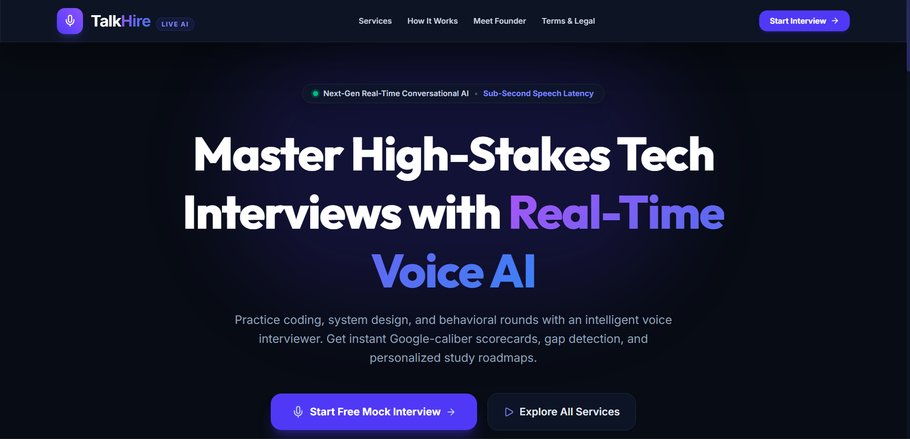
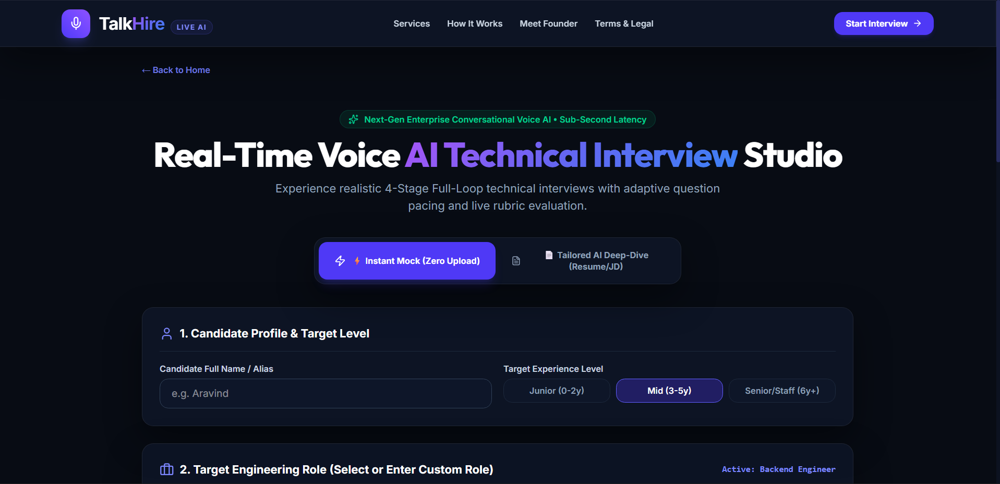

# 🎙️ TalkHire — Real-Time Sub-Second Voice AI Technical Interview Platform

<div align="center">

[](https://talkhir.me)
[](https://talkhir.me)
[](https://talkhir.me)
[](https://talkhir.me)
[](https://talkhir.me)

<br/>

**TalkHire** is an enterprise-grade, real-time conversational AI technical interview studio designed to simulate high-stakes **Google / Meta / Tier-1** engineering rounds. Featuring sub-300ms voice turn-taking, context-aware dynamic stage morphing, zero-server-load facial proctoring, and strict rubric scorecards.

</div>

---

## 🎬 Live Walkthrough & Interface Showcase

<div align="center">

### 📺 Real-Time AI Interview Voice Studio Walkthrough
https://github.com/user-attachments/assets/talkhire_live_demo.mp4

<video src="./assets/talkhire_live_demo.mp4" controls width="100%" style="border-radius: 14px; border: 1px solid #334155; box-shadow: 0 20px 25px -5px rgba(0, 0, 0, 0.5);">
  <p>Your browser does not support the video tag. View the demo video directly in <a href="./assets/talkhire_live_demo.mp4">assets/talkhire_live_demo.mp4</a>.</p>
</video>

<br/><br/>

### 📸 Studio Screenshots & Interface

| 🚀 10+ Engineering Roles & Deep-Dive Setup | 💻 Live Real-Time 4-Stage Studio |
| :---: | :---: |
|  |  |
| *Role presets, custom niche roles, and JD alignment* | *Dual video, lip-sync avatar, code IDE, and live subtitles* |

</div>

---

## 🏛️ 3D Core System Architecture

```text
┌────────────────────────────────────────────────────────────────────────────────────────┐
│                              🌐 CLIENT BROWSER TIER (Edge)                             │
│                                                                                        │
│   ┌──────────────────────────┐  ┌──────────────────────────┐  ┌────────────────────┐   │
│   │   3D Lip-Sync AI Avatar  │  │  MediaPipe AI Proctor    │  │ Live Audio Analyzer│   │
│   │   • Maya Realtime Mesh   │  │  • 3D Facial Landmarks   │  │ • FFT Voice Level  │   │
│   │   • Voice Reactivity     │  │  • 0% Server CPU / WASM  │  │ • Live Spectrum    │   │
│   └────────────┬─────────────┘  └────────────┬─────────────┘  └─────────┬──────────┘   │
│                │                             │                          │              │
│   ┌────────────┴─────────────────────────────┴──────────────────────────┴──────────┐   │
│   │                   STAGE-ADAPTIVE DYNAMIC WORKSPACE                             │   │
│   │   • Stage 1: Resume Verification  • Stage 2: Architecture & Scalability        │   │
│   │   • Stage 3: Live DSA IDE (Multi) • Stage 4: STAR Behavioral Framework         │   │
│   └──────────────────────────────────────────┬─────────────────────────────────────┘   │
└──────────────────────────────────────────────┼─────────────────────────────────────────┘
                                               │ WebRTC UDP / DataChannel
                                               ▼
┌────────────────────────────────────────────────────────────────────────────────────────┐
│                      ⚡ HIGH-THROUGHPUT MEDIA TRANSPORT MESH                          │
│                                                                                        │
│   ┌────────────────────────────────────────────────────────────────────────────────┐   │
│   │                           LiveKit SFU Cluster (Port 7881)                      │   │
│   │   • Sub-50ms Connection Handshake  • Adaptive Dynacast Audio Track Multiplex   │   │
│   │   • Reliable Event Data Channels   • Noise-Immune VAD Threshold (0.82)         │   │
│   └──────────────────────────────────────────┬─────────────────────────────────────┘   │
└──────────────────────────────────────────────┼─────────────────────────────────────────┘
                                               │ Zero-Copy Audio Pipeline
                                               ▼
┌────────────────────────────────────────────────────────────────────────────────────────┐
│                      🧠 CORE ORCHESTRATION & REASONING ENGINE                          │
│                                                                                        │
│   ┌───────────────────────────────┐           ┌────────────────────────────────────┐   │
│   │     FastAPI Async Engine      │           │      LiteParse Dual Ingestion      │   │
│   │   • Port 7862 Isolated Runtime│ ◄───────► │   • Skill Gap Detection Engine     │   │
│   │   • Multi-Candidate Isolation │           │   • Resume vs JD Matrix Matching   │   │
│   └───────────────┬───────────────┘           └────────────────────────────────────┘   │
│                   │                                                                    │
│   ┌───────────────┴────────────────────────────────────────────────────────────────┐   │
│   │                  Azure OpenAI Realtime Speech Engine (Shimmer)                 │   │
│   │   • Sub-300ms Spoken Turn-Taking  • Adaptive Question Depth (2-3 per stage)    │   │
│   │   • Function Tool Stage Switcher  • Strict 1.0 - 4.0 Rubric Evaluation Matrix  │   │
│   └────────────────────────────────────────────────────────────────────────────────┘   │
└────────────────────────────────────────────────────────────────────────────────────────┘
```

---

## 🔄 End-to-End Interview Dataflow

```mermaid
sequenceDiagram
    autonumber
    actor C as 👤 Candidate
    participant UI as 💻 TalkHire Studio (React 19)
    participant LK as ⚡ LiveKit SFU (WebRTC)
    participant BE as 🚀 Async Orchestrator (FastAPI)
    participant AI as 🧠 Azure OpenAI Realtime (Maya)

    C->>UI: Select Role (10+ Roles) & Track (Instant / Deep-Dive)
    UI->>BE: POST /api/livekit/session (Bootstraps token & room)
    BE->>LK: Mint JWT & Launch Background Bot Participant (51ms)
    UI->>LK: Connect WebRTC Audio & Data Channels
    AI-->>C: Spoken Proactive Greeting ("Welcome! Let's begin...")

    rect rgb(20, 25, 45)
    Note over C,AI: Stage 1 ➔ 2 ➔ 3 ➔ 4 Adaptive Interview Loop
    C->>LK: Spoken Response / Live Code Input
    LK->>AI: High-Immunity Audio Stream (VAD 0.82)
    AI->>AI: Evaluate Response Depth & Big-O Complexity
    AI->>LK: transition_stage() / submit_rubric_grade()
    LK-->>UI: Real-Time Data Channel Event (Morphs Studio Workspace)
    AI-->>C: Spoken Follow-up Probe or Stage Transition
    end

    C->>UI: End Interview Session
    UI->>BE: Aggregate Multi-Stage Rubrics (1.0 - 4.0 Standard)
    UI-->>C: Generate Comprehensive Scorecard, Gaps & Study Roadmap
```



---

## 🎨 Stage-Adaptive Context-Aware Workspaces

TalkHire automatically transforms the candidate's workspace based on the active interview discipline, completely eliminating screen clutter:

```text
┌────────────────────────────────────────────────────────────────────────────────────────┐
│ STAGE 1: RESUME & BACKGROUND CROSS-EXAMINATION                                         │
├────────────────────────────────┬───────────────────────────────────────────────────────┤
│ • 👩‍💼 Maya Avatar (Full Lip-Sync) │ • 👤 Candidate Profile & Key Experience Highlights    │
│ • 📹 Candidate Webcam          │ • 🎯 Target Role & Key Skills Verification Matrix     │
│ • 💬 Live Voice Subtitles Card │ • 📋 Discussion Pillars (Scale, Incidents, Choices)   │
│ • 🌊 Voice Spectrum Visualizer │ • 📝 Candidate Quick Project Talking Points Pad       │
└────────────────────────────────┴───────────────────────────────────────────────────────┘

┌────────────────────────────────────────────────────────────────────────────────────────┐
│ STAGE 2: SYSTEM ARCHITECTURE & SCALABILITY                                             │
├────────────────────────────────┬───────────────────────────────────────────────────────┤
│ • 👩‍💼 Maya Avatar               │ • 🏛️ System Architecture Planner & Canvas             │
│ • 📹 Candidate Webcam          │ • 📐 Component Tags (API Gateway, Redis, Kafka, DB)   │
│ • 💬 Live Voice Subtitles Card │ • 📦 Capacity Estimations (RPS, Storage, SLA 99.99%)  │
│ • 🌊 Voice Spectrum Visualizer │ • 📝 High-Level Failure Recovery & Sharding Schema    │
└────────────────────────────────┴───────────────────────────────────────────────────────┘

┌────────────────────────────────────────────────────────────────────────────────────────┐
│ STAGE 3: LIVE CODING & ALGORITHMS (DSA)                                                │
├────────────────────────────────┬───────────────────────────────────────────────────────┤
│ • 👩‍💼 Maya Avatar               │ • 💻 Pro Code Editor (Python 3.12, TS, Go, Java 21)   │
│ • 📹 Candidate Webcam          │ • ⚡ Monospace Syntax Scratchpad & Line Numbers       │
│ • 💬 Live Voice Subtitles Card │ • 📤 "Share Code Snapshot with Maya" Instant Action   │
│ • 🌊 Voice Spectrum Visualizer │ • 📊 Live Complexity Checklist: O(N) Time / O(1) Space│
└────────────────────────────────┴───────────────────────────────────────────────────────┘

┌────────────────────────────────────────────────────────────────────────────────────────┐
│ STAGE 4: BEHAVIORAL & LEADERSHIP (STAR METHOD)                                         │
├────────────────────────────────┬───────────────────────────────────────────────────────┤
│ • 👩‍💼 Maya Avatar               │ • 🎯 S - Situation (Context & Challenge Root Cause)   │
│ • 📹 Candidate Webcam          │ • 📌 T - Task (Specific Technical Responsibility)     │
│ • 💬 Live Voice Subtitles Card │ • ⚡ A - Action (Execution, Decisions & Leadership)   │
│ • 🌊 Voice Spectrum Visualizer │ • 🏆 R - Result (Measurable Business Impact & Lessons)│
└────────────────────────────────┴───────────────────────────────────────────────────────┘
```

---

## 🛡️ Client-Side Low-Spec AI Proctoring Engine

Designed for low-end hardware (dual-core Intel i3, AMD, Celeron, budget laptops) with **zero server CPU overhead**:

```text
       Webcam Stream (480p @ Edge)
                  │
                  ▼
   ┌──────────────────────────────┐
   │   WebGL / GPU Available?     │
   └──────┬────────────────┬──────┘
      YES │                │ NO
          ▼                ▼
   ┌─────────────┐  ┌──────────────────────────────┐
   │ GPU Delegate│  │ WebAssembly SIMD CPU Fallback│  <-- Sub-3ms Execution Time
   └──────┬──────┘  └──────────────┬───────────────┘
          └───────────────┬────────┘
                          ▼
             Google MediaPipe Landmarker
             • Nose Tip: Landmark 1
             • Eye Corners: 33 & 263
                          │
                          ▼
            Yaw Ratio Vector Calculation
           (0.35 ≤ Normal Glancing ≤ 2.85)
                          │
                          ▼
         5-Second Sustained Hysteresis Filter
         (0% False Positives on Editor Glances)
```

- **Throttled 1400ms Sampling**: Executes ~0.7 times/sec, consuming **`< 0.3% CPU`** and **`< 15MB RAM`**.
- **100% Privacy-Preserving**: Video never leaves candidate's browser; only status metrics are processed.

---

## 📊 Strict 1.0 – 4.0 Rubric Evaluation Standard

TalkHire enforces strict zero-tolerance grading mirroring Tier-1 engineering bar-raisers:

```text
┌────────────────┬──────────┬───────┬────────────────────────────────────────────────────┐
│ VERDICT        │ SCORE    │ GRADE │ CRITERIA                                           │
├────────────────┼──────────┼───────┼────────────────────────────────────────────────────┤
│ Strong Hire    │ 3.5 – 4.0│ S-Tier│ Optimal algorithmic logic, O(N) complexity, trade- │
│                │          │       │ offs defended, structured STAR leadership impact.  │
├────────────────┼──────────┼───────┼────────────────────────────────────────────────────┤
│ Hire           │ 2.8 – 3.4│ A-Tier│ Solid implementation, minor edge-case hint needed, │
│                │          │       │ clear communication of past architectural scale.   │
├────────────────┼──────────┼───────┼────────────────────────────────────────────────────┤
│ Lean Hire      │ 2.0 – 2.7│ B-Tier│ Working solution with sub-optimal space/time       │
│                │          │       │ trade-offs, partial system design sharding plan.   │
├────────────────┼──────────┼───────┼────────────────────────────────────────────────────┤
│ No Hire        │ 1.0 – 1.9│ C-Tier│ Struggled with core CS fundamentals, incorrect     │
│                │          │       │ data structure choice, missed key scaling flaws.   │
├────────────────┼──────────┼───────┼────────────────────────────────────────────────────┤
│ Strong No Hire │ 0.0 – 0.9│ F-Tier│ Silent, prolonged hesitation, or unable to         │
│                │          │       │ articulate basic computational logic (0 tolerance).│
└────────────────┴──────────┴───────┴────────────────────────────────────────────────────┘
```

---

## 🎯 Dual-Mode Track Routing

```text
┌────────────────────────────────────────────────────────────────────────────────────────┐
│ ONBOARDING SELECTION ROUTER                                                            │
├──────────────────────────────────────────────────┬─────────────────────────────────────┤
│ 🌟 Full Comprehensive Loop (All 4 Stages)        │ 🎯 Targeted Single-Round Tracks     │
│ • Progressive Guided Lock (Stages 1 ➔ 2 ➔ 3 ➔ 4) │ • Live Coding & Algorithms (DSA)    │
│ • Multi-Stage Evaluator Matrix                   │ • System Design & Scalability       │
│ • Full Loop Debrief & Study Roadmap              │ • Behavioral & Leadership (STAR)    │
│                                                  │ • Resume Cross-Examination          │
└──────────────────────────────────────────────────┴─────────────────────────────────────┘
```

---

## ⚡ Production Deployment Stack

```text
┌────────────────────┬──────────────────────────────────┬────────────────────────────────┐
│ COMPONENT          │ TECHNOLOGY / ENGINE              │ ROLE & SPECIFICATION           │
├────────────────────┼──────────────────────────────────┼────────────────────────────────┤
│ Production Domain  │ https://talkhir.me               │ Let's Encrypt Automated TLS/H3 │
│ Frontend Web App   │ React 19 + TypeScript + Vite 6   │ Single-Page Glassmorphic UI    │
│ Backend Service    │ FastAPI + Python 3.12 (Port 7862)│ Async Bot & Session Router     │
│ Media Infrastructure│ LiveKit SFU (Ports 7881 / 7882) │ Real-Time WebRTC Media Gateway │
│ Voice AI Model     │ Azure OpenAI Realtime Mini       │ Voice: "shimmer" | Sub-300ms   │
│ Client Vision AI   │ MediaPipe Tasks Vision WASM      │ 3D Face Landmark Proctoring    │
│ Container Mesh     │ Docker Compose (Host Networking) │ Zero-Bridge Latency Isolation  │
└────────────────────┴──────────────────────────────────┴────────────────────────────────┘
```

---

## 👨‍💻 Founder & Chief Architect

<div align="center">

### **Aravind**
*Founder & Chief Architect — TalkHire*

*"Most candidates fail technical interviews not because they lack coding intelligence, but because they haven't practiced articulating complex architectural decisions under real-time conversational pressure. TalkHire gives every engineer a realistic, 24/7 AI interview partner that builds authentic confidence and bridges every skill gap."*

</div>

---

<div align="center">

**[Experience TalkHire Live at talkhir.me](https://talkhir.me)**

*Built with precision for software engineers worldwide.*

</div>
